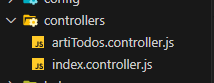
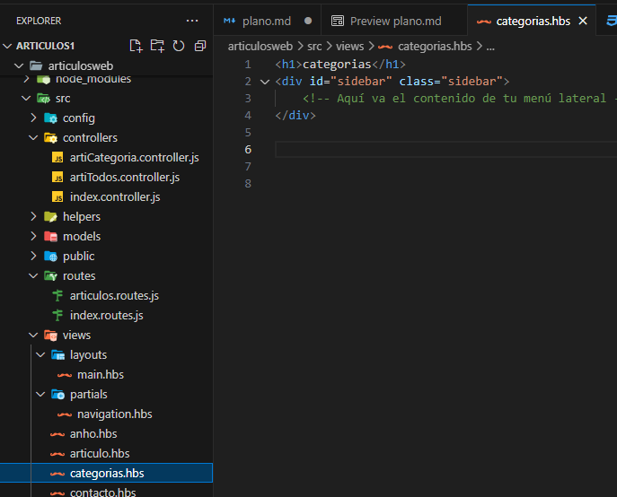

# Plano Articulos
<!-- (ctrl + shift + v ) para abrir la vista del markdown en vscode-->
##### Lo que primero necesitamos es definir la funcionalidad de la app y su modelo.

***
#### Funcionalidad
* ##### La app articulo nos deberia facilitar la creacion de articulos,es decir cargar los titulos,hashstags,imagenes,info.Una vez cargado se crea un articulo y se guarda en la pag.
***
#### Modelo
* modeloArticulo{

        articulo_id:{

            type: int
        } 

        titulo:{
    
            type: String,
            required: true
        }
    
        infoTitulo: {
    
            type: String,
            required: true
        }
    
        voto:{
    
            T || F
        }
    
        img:{
    
            type: String,
            (url)
            required: true
        }
    
        hashtags:{
    
            type: String,
            required: true
        }
    
        infoSecciones:{
    
            secciones_id
               .
               .
               .
            seccion[n]
        }

    }

* modeloSeccion:{

        secciones_id:{

            type: int
        }

        titulo: {
    
            type:string,
        }
    
        img: {
    
            type:string,
        }
    
        info:{
    
            type:string
        }
    
        img{
    
            type:string
        }
}
<kbd>
    -----   
</kbd>

***
##### Vamos a definir los paquetes a utilizar:
* **express**: Para manejar las solicitudes y respuestas del servidor
* **express-handlebars**: Para usar handlebars como nuestro motor de plantilla
* **mongoose**: Para interactuar con la base de datos que va a almacenar los articulos
##### Ahora los paquetes de desarrollo:
* **dotenv**: Para cargar variables de entorno desde un aarchivo **.env** en **process.env**,es muy util para manejar configuraciones secretas ( como cadenas de conexion a la base de datos) que no querramos incluir directamente en el codigo
* **nodemon**:Si trabajamos con nodejs nos ayuda a reiniciar  la app o servidor cuando se detectan cambios de archivo de directorio.Nos ayuda a no estar reiniciando cada cambio que hagamos
* **npm-check-updates**:Nos premite verificar facilmente si hay actualizaciones disponibles para nuestras dependencias
* **-D**:Lo utilizamos con npm install para decirle que estamos instalando esos paquetes como dependencias de desarrollo
***
#### Luego necesitamos definir la estructura  autilizar
##### Creamos la carpeta que almacena la app "**src**"
##### Dentro creamos las siguientes carpetas para estructurar la app src/
* config
* controllers
* helpers
* models
* public
* routes
* views
* archivo index
* archivo server
* archivo database

***
##### Luego en nuestro servidor vamos a estructurar el codigo:
* ##### // Initializations:Aqui podemos inicializar nuestros modulos o librerias,como express y conectar con la base de datos.
* ##### // Settings:En esta seccion podemos configurar las propiedades de la aplicacion ,como el puerto en el que se ejecutara tu servidor y la configuracion de tus vistas(si utilizamos un motor de plantilla)
* ##### //  Middlewares:Los middleswares son funciones que tienen acceso al objeto de solicitud (req),al objeto respuesta (res) y a la siguiente funcion middleware en el ciclo de solicitud/respuesta de la app.
* ##### // Global Variables:Aqui definimos las variables que queremos que esten disponibles en toda la app
* ##### // Routes: A qui es donde definimos las rutas de la app,es decir,que funcion se debe ejecutar cuando se recibe una solicitud a una url especifica
* ##### // Static Files:Esta secion es oara servir archivos estaticos como imagenes,archivos css y archivos js

***
##### Seguimos ahora vamos a configurar el puerto ya que hay veces que la nube donde va a estar nuestra app  nos proveera otro puerto,para eso vamos a // settings con app.set() y vamos a utilizar en index.js con app.get().
***
##### Por defecto al crear un proyecto con node la carpeta "views" esta al inicio,pero como aca esta dentro de src vamos a indicarle el camino al servidor para que pueda encontrar la carpeta sin problemas.
* ##### podemos ir a // settings y con el mismo metodo de express app.set asignarle a una variable el valor __dirname que practicamente nos da la ubicacion desde el inicio del sistema operativo hasta el archivo donde estamos, --app.set("views",__dirname + '/views')-- osea concatenamos toda la direcion hasta src/  con la carpeta views ,.......--/src/views--
* ##### ahora como dependiendo del sistema operativo que se utilice las direcciones o rutas cambian / o | .Utilizamos el metodo path.join y quedaria algo asi ,antes importemos la libreria --const path=requiere('path');--
<div class="alert alert-block alert-success">

    app.set('views',path.join(__dirname,'views'))
</div>

***
##### Ahora cuando enviamos y recibimos datos del servidor en general lo hcamos a traves de un formulario o a traves de un json,para soportar ese tipo de datos que va a recibir el servidor existen unas configuraciones o estrucura // middlesware.
<div class="alert alert-block alert-success">

    app.use(express.urlcoded({extended:false}))
</div>

##### Basicamente sive para que los datos recibidos o enviados a travez del servidor por los metodos http ,como post,put que se utilizan para enviar datos,estos se incluyen al cuerpo de la solicitud pero necesitan ser decodificados  en un formato que entienda javascript,
##### Esa linea de codigo toma los datos de la url y los convierte en objeto javascript y ese objeto se adjunta al req.body por lo que podemos accceder a los datos en nuestras rutas post, put.
***
##### Ahora podemos crear nuestra primera ruta,vamos a la estructura // routes
<div class="alert alert-block alert-success">
    
    app.get('/',(req,res)=>{res.send("Hola mundo")})
</div>

##### ahora cada que nos pidan la ruta principal '/' el  servidor le envia un hola mundo

***
##### Ahora los archivos estaticos son los que cualquiera puede acceder,eso lo controlamos en la estructura //static files con --app.use(express.static())-- si no colocamos nada el entiende que los archivos estaticos  son los de la carpeta /public,para mejor control vamos a decirle explicitamente donde se encuentra
<div class="alert alert-block alert-success">
    
    app.use(express.static(path.join(__dirname,'public')))
</div>

***
##### Para ahorrar tiempo configuraremos el script de nuestro package.json,reemplazamos la linea de "test" por --"start":"node src/index.js"--,practicamente le decimos cada que escribamos en la consola npm start,ejecuta ese comando.
##### Podemos agregar otro script debajo de start, que se llame "dev":"nodemon src/index.js",y lo corremos en la terminal con "npm run dev",ya que los script diferentes al nombre start generalmente se ejecutan anteponiendo "run" del script.
***
##### Ahora conectemos a nuestra base de datos:
    una vez activamos el servicio mongodb del administrador de tareas,podemos abrir otra terminal y ejecutar el comando --mongod--
* ##### creamos una base de datos que se llame articulos-app y sus respectivas colecciones articulo,secciones.
***
##### Ahora podemos ir a nuestro archivo database.js y conectar nuestro servidor con nuestra base de datos.
```
const mongoose= require('mongoose');
const MONGODB_URI='mongodb://localhost/articulos-app'
mongoose.connect(MONGODB_URI,{

})
.then(db=> console.log("Database is connected"))
.catch(err=> console.log(err));
```
* ##### entonces decimos que a travez del protocolo mongodb:// utilizaremos la base de datos  articulo-app que esta en nuestro localhost
* ##### importamos el archivo database a nuestra arrancador index.js  `require(./database)`
***
* ##### ahora nuestra direccion a la base de datos podria ver cualquiera que toque nuestro codigo ya que esta expuesta `const MONGODB_URI='mongodb://localhost/articulos-app'`  asi que utilizaremos un paquete para resguardar la direccion.
* ##### requerimos el paqute dotenv en el index.js pero no todo,solo un modulo config `require('dotenv').config()`

* ##### Entonces si existe un archivo .env al inicio de nuestro proyecto es decir al mismo nivel que src,package.json etc ,pues va a leer lo que tiene dentro y lo asignara a variables de entorno


***
##### Escribamos las variables de entorno en .env
```
ARTICULO_APP_MONGODB_HOST=localhost
ARTICULO_APP_MONGODB_DATABASE=articulos-app
```
* ##### Ahora usemoslo en database.js `const {ARTICULO_APP_MONGODB_HOST,ARTICULO_APP_MONGODB_DATABASE}=process.env` como process.env es un objeto que guarda esa variables ,podemos simplemente extraer esas variables que necesitamos.
* ##### entonces const MONGODB_URI='mongodb://localhost/articulos-app' quedaria asi:`const MONGODB_URI='mongodb://${ARTICULO_APP_MONGODB_HOST}/${ARTICULO_APP_MONGODB_DATABASE}`esto deberia estar en comilas invertidas para que ejecute el codigo js con el html.
##### Ahora tenemos nuestras configuraciones basicas para guardar variables de entorno
***
##### Como hay achivos que no queremos que se vean por ejemplo el .env o el node_modules  podemos crear un .gitignore

##### y poner los archivos que no queremos que se suban al github
```
.env  
node_modules
```
***
#### Ahora vamos a modelar los datos:
* ##### vamos a ir a nuestra carpeta models y vamos a crear dos modelos que van a estar relacionadas,entonces creamos los dos archivos, **articulo.js,seccion.js**.

* ##### vamos a importar dos clases de mongoose en  articulo.js y seccion.js `const {Schema,model}=require('mongoose');`
##### Schema:--nos permite definir el esquema es decir armar el modelo y guardarlo en mongodb.
##### model:--que a partir de un schema nos permite crear una clase  para tener metodos  y propiedades que vamos a acceder con codigo.
***
##### Corregi un poco el codigo y el orden de los modelos:
* ##### primero los esquemas o modulos los puse en un solo archivo ya que seccion es muy chico y no hace falta separarlo.
* ##### modifique los atributos o metodos ,seccion_id no hace falta pq ya le asigna mongodb un id,type:int no existe es Number.
* ##### como articulo necesita de seccion ,el orden si importa por lo que primero definiremos la seccion.
##### quedaria algo asi: 
***
***


***
***
##### Ahora veamos el motor de plantilla:
* #####  vamos a devolver vistas html,utilizaremos el modulo express-handlesbar
* ##### como ya lo intalamos ahora ,vamos a importar el modulo al servidor --`const exphbs=require('express-handlebars')`--

* ##### ahora toca configurar el engine, el “engine” se refiere a la biblioteca o módulo que se utiliza para renderizar las vistas de tu aplicación. En este caso, express-handlebars es el engine.
* ##### entonces nos vamos a settings del servidor y realizamos la config.

***
##### Bueno en la carpeta views vamos a tener dos carpetas layouts y partials:
* #####  layouts:son una especie de plantilla donde vamos a colocar el codigo comun html que van a estar en todas las vistas ej  el nav el footer,y desde cualquier otro archivo llamaremos a esa plantilla.
* ##### partials:son los pedazos de hatml que vamos a poder importar  en otros archivos html.
* ##### como podemos crear multiples plantilla tambien necesitamos decirle cual es la plantilla por defecto que ya configuramos en el //settings en este caso se llamara "main".

* ##### una vez creada las plantillas tenemos que renderizar para eso vamos a ir a server.js

* ##### creamos un index donde va a estar el cuerpo es decir el body y renderizamos el index  que no esta en partials ni en layouts pq lo que esta dentro de esas carpeta son plantillas ,ahora lo que esta afuea si son archivos que podemos renderizar y luego llamar a las plantillas
***
##### Ahora crearemos las rutas para las distintas paginas:
* ##### para eso vamos a la carpeta routes y ahi crearemos los archivos que contendran las rutas que vamos a utiliar en el servidor.`routes/index.routes.js`

 * ##### entonces cada que pidan algo con las rutas ejecutaremos una accion
 * ##### requerimos un metodo de la libreria express Router:`const{Router}=require("express")`; esto lo importaremos en index.routes.js
 * ##### ese router lo tenemos que ejecutar pq es una funcion `Router();`cuando se ejecuta Router() esto nos devuelve un objeto por eso lo guardaremos en una constante `const router=Router();`
 * ##### Con ese router vamos a definir una especie de ruta para eso vamos a exportarlo.`module.exports=router;`pq lo exportamos pues pq ese router va a ser utilizado por el servidor o elr archivo del servidor  server.js
 
 ***
 ***
 * ##### Entoncs ahora vamos a nuestro servidor server.js a la seccion de //routes y vamos a mejorar el codigo entonces ahora en vez de tener ```app.get('/',(req,res)=>{res.render('index')});``` podemos tener `app.use(require('./routes/index.routes'))`
 * ##### basicamente le decimos ahora ve a la carpeta routes entra al archivo index.routes y busca ahi que hacer en caso de llamar a alguna ruta en particular.
 * ##### por lo que ahora debemos reescribir  las rutas que habiamos borrado  ```app.get('/',(req,res)=>{res.render('index')});```ahora pasaria a ser asi  `router.get('/',(req,res)=>{res.render('index')});`si como te das cuenta reemplazamos "app" por "router"
 * ##### podemos ir anhadiendo las demas rutas por ejemplo la pagina /nosotros,/contacto etc :`router.get('/nosotros',(req,res)=>{res.render('nosotros')})` entonces ahora crearemos el archivo "nosotros.hbs"
 
 
 
 ***
 ***
 * ##### todo perfecto hasta ahi presionando cualquier de esos enlaces ya nos redirigia la pagina y nos cargaba.El problema es que no es muy eficiente a largo plazo pq en una app grande podriamos tener muchas funciones para una pagina o una ruta por lo que seria tedioso escribir todas las funciones directamente en el `router.get`.
 * ##### entonces para hacerlo mas escalable podriamos `router.get('/"ruta",funcion')` si exactamente todas las funciones las manejaremos en la carpeta src/controllers de "controladores" pq ahi vamos a tener los archivos de las rutas que van a tener las n funciones para las rutas.
 ***
 ***
 #### Controladores
 * ##### Como habiamos previsto ahora remplazameros las (req,res) por funciones que vamos a manejar en los controladores 
 * ##### src/controllers/index.controller.js nuestro primer controlador de la pagina index,entonces dentro del archivo vamos a crear un objeto que va a almacenar todos los metodos es decir tods las funciones  que va a manejar index `const indexCtrl={};`
 * ##### entonces para crear metodo rapido podemos simplemente escribir el ombre del objeto."el metodo " ejemplo `indexCtrl.renderIndex=(req,res)={res.render('index')};`como te das cuenta creamos una propiedad al objeto con el metodo que ya habiamos definido,por que vamos a exportar esa propiedad que es un metodo y vamos a utilizarlo en router.get('/"ruta"',renderIndex);
 * ##### por lo que ahora en vez de `router.get('/',(req,res)=>{res.render('index')})` vamos a tener `router.get('/',renderIndex);`
 * ##### por lo que ahora solo falta exportar en index.routes estos metodos `const {renderIndex,renderNosotros,renderContacto}=require('../controllers/index.controller');`

***
### Ahora muchisima atencion conectaremos extraeremos,cargaremos datos y pasaremos a nuestra pagina
* ##### Primero: Vamos al controlador de nuestra pagina en este caso index,que tiene como controlador index.controller.js,vamos a importar nuestro "esquema" o "coleccion " en este caso queremos simplemente la propiedad "titulo" para pasarle a nuestro index.
***
***

***
***

***
***
* ##### Segundo:en nuestra metodo o propiedad vamos a agregar para que busque el primer articulo en nuestra base de dato pero esto es asyncrono asi que modificamos la funcion,creamos una constante "articulo" que va a contener el articulo encontrado y en caso de que sea null retorne no se encontro ningun articulo,una vez que tenga algun dato rendirizamos la pag y le pasamos la propiedad que queremos y lo guardamos en estecaso tituloy para utilizarlo simplemente vamos al archivo index.handlevar y entre doble llaves  escribimos el nombre de la propiedad pasada. 

```
indexCtrl.renderIndex= async (req,res)=>{
    const articulo=await Articulo.findOne(); // busca un artículo,el primero en realidad con findOne
    if (!articulo) {
        return res.status(404).send('No se encontró ningún artículo');
      }
    res.render('index',{titulo:articulo.titulo})// pasa el título del artículo a la vista
};
```

* ##### con esto pasamos los datos que haya ahora te ensenhare como cargarlos
* ##### Tercero: Para cargar los datos simplemente podemos escribir un script en cualquier archivo js  previamente importando los datos de la coleccion ,cargar los nuevos datos y guardar .Ejemplo vamos a nuestro archivo articulo.js si nuestro modelo
* ##### mejoramos un poco el codigo 
```
const Articulo=model('Articulo', articuloSchema);
const Seccion=model('Seccion', seccionSchema);
module.exports = {
    Articulo,
    Seccion,
  };
```
* ##### luego justo aqui debajo escribiremos el script
* ##### 1. creamos una coleccion ej:
```
const articuloData = {
    articulo_id: 1,
    titulo: 'Mi TERCER artículo',
    infoTitulo: 'Este es mi primer artículo',
    voto: 0,
    img: 'ruta/a/mi/imagen.jpg',
    hashtags: '#primerArticulo',
    infoSecciones: [
      {
        titulo: 'Sección 1',
        imgInicio: 'ruta/a/mi/imagen.jpg',
        info: 'Esta es la sección 1 de mi artículo',
        imgFinal: 'ruta/a/mi/imagen.jpg',
      },
      // más secciones aquí...
    ],
  };
```
* ##### ahora para que funcione instanciaremos el articulo
```
(async () => {
    // crea una nueva instancia de Articulo
    const nuevoArticulo = new Articulo(articuloData);
  
    // guarda la nueva instancia en la base de datos
    try {
      await nuevoArticulo.save();
      console.log('Artículo guardado con éxito');
    } catch (err) {
      console.log('Hubo un error al guardar el artículo:', err);
    }
  })();
```
* ##### luego lo guardamos en una constante y luego guardamos ese objeto que esta en la constante en la base de datos 
* ##### fin acabamos de cargar datos y guardarlos en la base de datos
* ##### los datos de articuloData podemos modificarlo y al guardar el archivo automaticamente se cargarian a la base de datos 
* ##### recuerda que te dije que podiamos hacerlo desde cualquier archivo js simplemente abrian que importar el modelo y cargar los datos y guardar ,modificar siempre que carguemos datos nuevos y volver a guardar .
***
* ##### continuando ya cargamos el titulo ahora queremos cargar toda la demas info:titulo,infotitulo,voto,img,hashrags,infosecciones[]
* ##### para cargar infotitulo,voto es lo mismo simplemente pasamos los datos a nuestro handelbar con el controlador index.controller.js
***
***

***
***

***
***
* ##### ahora vamos a pasar la img como nosotros no vamos a guardar la imagen en si en la base de datos podemos simplemente servir esa img desde una base de datos en la nube("ojo que la direccion debe ser a la imagen es decir mega google drive no nos da una direccion directa a la imagen si no una pagina donde podemos ver la imagen por ese motivo se suele usar otros servicios que si te proporcionana acceso directo a la imagen como aws,...,pero nosotros usaremos uno gratuito (postimg) una nube de imagenes universal digamos ya que cualquiera carga la imgen")
* ##### una vez que subimos la imagen a postimg podemos copiar el link y guardar en nuestra base de datos

* ##### lo pasamos al handelbar


* ##### lo utilizamos en el handelbar

* ##### hacemos lo mismo con el hastags y quedaria algo asi


* ##### como vemos tenemos el titulo,el infotitulo,el voto,la img,el hastag pero faltan las secciones
* ##### recordemos que cada esquema o coleccion de "Seccion" forma parte de "Articulos",cada seccion consta de titulo,imgInicio,info,imgFinal
* ##### entonces en articulo tendriamos una propiedad del tipo arreglo que se llamaria infosecciones:[Seccion] que tendria las secciones
* ##### eso quiere decir que ahora no le pasamos un valor sino que le pasamos un arreglo de objetos al handelbar.
* ##### entonces le pasamos al handelbars

* ##### lo utilizamos,para recorrerlo utilizaremos #each que se posiciona en un elemento y luego podemos utilizarlo con this.elemento

***
***
* ##### quedaria algo asi

* ##### otro ejemplo cargando mas secciones en el articulo


* ##### si tenemos algun error para usar el each se soluciona 

***
***
#### Ahora veamos la funcionalidad del boton Voto
##### Lo que buscamos seria que un usuario pueda darle like o dislike a un articulo,obviamente solo se podria si es que se verifica que esta con su usuario de google o gmail.
* ##### Entonces el primer paso seria crear el boton y estilo front end  
 

* ##### ahora buscamos el funcionamineto recordemos paso a paso como funciona nuestra estructura , como la funcionalidad va a estar por ahora en esa pagina index,vamos a utilizar una ruta para el voto en el enrutador que maneja la pagina index es decir index.routes.js , ya que vamos a requerir info del servidor y actualizar(vamos a requerir los votos del articulo y al darle like o dislike actualizar los votos) por lo que la ruta manejariamos con un POST,oobviamente la funcionalidad es decir la logica la manejariamos ocn un controllador y como la funcionalidad es en index pues utilizaremos index.controller.js.
* ##### esto en index.routes.js `router.post('/voto/:id',handleVoto);` 
* ##### esto en index.controller.js 


* ##### genial hasta ahi tenemos toda la logica de las rutas y los controladores ,ahora nos falta conectar con el boton para eso podriamos utilizar  AJAX,FETCH,AXION o el metodo de formulario es decir estos son los metodks para realizar las peticiones.
* ##### utilizaremos fetch entonces nos vamos a nuestra pagina que necesita el script en este caso index.hbs ,no separamos pq es mejor aca por el momento,entonces debajo de todo abrimos un script y escribimos el fetch
```
    document.querySelectorAll('.botonlike button').forEach(button => {
      button.addEventListener('click', function() {
        var voto = this.classList.contains('bi-hand-thumbs-up') ? 1 : -1;
        var id = '{{id}}';
        console.log('ID del artículo:', id); // Esta línea imprimirá el ID delartículo en      la consola
        // Verificar si voto es un número
        if (isNaN(voto)) {
          console.error('Voto inválido');
          return;
        }
        // Imprimir el valor de voto
        console.log('Valor de voto:', voto);
        fetch('/voto/' + id, {
          method: 'POST',
          headers: {
            'Content-Type': 'application/json'
          },
          body: JSON.stringify({ voto: voto })
        })
        .then(response => {
          if (!response.ok) {
            throw new Error('Error al registrar el voto');
          }
          return response.json();
        })
        .then(data => {
          // actualiza el recuento de votos en la página
          var votosActuales = parseInt(document.querySelector('.botonlike p')textContent);
          document.querySelector('.botonlike p').textContent = votosActuales +voto;
        })
        .catch(error => {
          console.error('Error:', error);
        });


```
* ##### 1 - document.querySelectorAll('.botonlike button'): Esta línea selecciona todos los elementos del DOM que sean botones y que estén dentro de un elemento con la clase ‘botonlike’. Devuelve una lista de estos elementos.
* ##### 2 - forEach(button => {...}): Este es un bucle que recorre cada elemento de la lista devuelta por querySelectorAll. En cada iteración, el elemento actual se pasa como argumento a la función de flecha. En este caso, cada elemento es un botón, por eso el argumento se llama ‘button’.
* ##### 3 - button.addEventListener('click', function() {...}): Aquí se está añadiendo un escuchador de eventos a cada botón. Este escuchador se activará cada vez que se haga clic en el botón. Cuando esto ocurra, se ejecutará la función que se pasa como segundo argumento.
* ##### 4 - var voto = this.classList.contains('bi-hand-thumbs-up') ? 1 : -1;: Esta línea verifica si el botón que se ha hecho clic tiene la clase ‘bi-hand-thumbs-up’. Si la tiene, asigna 1 a la variable ‘voto’. Si no la tiene, asigna -1.
* ##### 5 - var id = '{{id}}';: Aquí se está asignando un valor a la variable ‘id’. Parece que este valor debería ser reemplazado por el ID del artículo, pero en tu código actual, siempre será ‘{{id}}’.
* ##### 6 -  fetch('/voto/' + id, {...}): Esta línea realiza una solicitud HTTP POST a la ruta /voto/ seguida del ID del artículo. El cuerpo de la solicitud es un objeto JSON que contiene el voto, enviando el valor de ‘voto’ en el cuerpo de la solicitud. La ruta de la solicitud se construye concatenando ‘/voto/’ con el valor de ‘id’.
* ##### 7 -  .then(response => {...}): Aquí se está manejando la respuesta del servidor. Si la respuesta no es exitosa (es decir, si el código de estado no es 200), se lanza un error.
* ##### 8 -  .then(data => {...}): Si la respuesta del servidor es exitosa, se actualiza el recuento de votos en la página. Se obtiene el recuento actual de votos, se le suma el valor de ‘voto’ y se actualiza el texto en la página.
* ##### 9 -  .catch(error => {...}): Si ocurre algún error en cualquier parte del proceso, se maneja aquí. El error se imprime en la consola.


algunos  tips 
* ##### Esto podría deberse a cómo se está manejando la solicitud en el servidor. Cuando se recibe una solicitud POST, los datos se envían en el cuerpo de la solicitud. En Express.js, estos datos se pueden acceder a través de req.body. Sin embargo, req.body será undefined a menos que se use un middleware para analizar los datos entrantes.

* ##### En tu servidor, estás utilizando el middleware express.urlencoded({extended:false}), que analiza los cuerpos de las solicitudes entrantes codificadas en URL. Sin embargo, en tu código del lado del cliente, estás enviando los datos como JSON. Esto significa que necesitas usar el middleware express.json() para analizar los datos entrantes.

* ###### Puedes agregar el middleware express.json() a tu servidor de la siguiente manera:

***
#### Bueno ahora manejaremos el menu despegable Articulos(Todos,Anhos):

##### primero crearemos el handlebars ,todos.hbs luego podemos ir a la ruta como esta es una nueva pagina podemos crear un nuevo router para esa pagina.


##### Entonces seguimos el mismo paso de siempre para la ruta importamos las bibliotecas creamos el router=Router(); luego creamos nuestras rutas por ejemplo:
* #####  router.get('/articulos/todos'),"su controlador"
* ##### router.get('/articulos/:id',"su controlador")

* ##### como creamos un nuevo router debemos avisar a nuestro servidor 

* ##### ahora como tenemos otra pagina debemos crear los controladores para esa pagina para eso creamos un nuevo controlador para esas rutas artiTodos.controller.js

* ##### ahora seguimos el mismo proceso como vamos a requerir datos de nuestra base de datos vamos a importar el objeto que necesitamos ,tambien crearemos un objeto que contendra todos los metodos de este controllador.

* ##### Entonces el primer controllador seria renderArtiTodos que se encargara de renderizar en la pag todos.hbs todos los objetos articulos en nuestra base de datos,por orden del ultimo al primero.

* ##### Entonces primero sepamos que como trabajamos con base de datos pueden haber inconvenientes en la comunicacion por lo que la funcion debe ser async(req,res)=>{},
* ##### Entonces guardamos en una constante articulos todos los objetos es decir articulos pasa a ser un array de objetos debido a la funcion que utilizamos en este caso find() nos devuelve todo en un array,con sort({_id:-1}) lo ordenamos del ultimo al primero,con . lean () para que funcione no me acuerdo bien.
* ##### ahora ya tenemos todos los articulos en const articulos,toca imprimirlos,para pasar a nuestro hbs bien sin errores o arrays vacios necesitamos condicionar,le metemos un if (articulos.length > 0){res.render('todos',{articulos:articulos});},es decir si hay algun objeto renderizamos si no ejecutamos el else.El else solo nos manda el error,como vimos tambien pasamos el objeto a nuestro todos.hbs ya que necesitamos.
* ##### Una vez que ya pasamos el objeto a nuestro hbs 'todos', { articulos: articulos },podemos pasar al hbs.

* #####  Entonces usaremos boostrap para tener un disenho de cartas ,una vez que pegamos el link en el main.hbs podemos pasar a nuestra pag todos.hbs y pegar su codigo.

* ##### al la clase cad lo envolvemos en un #each de hbs,que practicamente toma un elemento del array,luego el segundo luego el tercero y asi hasta el final,en este caso recorremos #each articulos y simplemente reemplazamos los campos,para acceder a la img podemos usar this.img,this.titulo es decir this."propiedad" y listo luego para darle estilo podemos usar el style.css en la carpeta public

* ##### ahora como vemos cada carta tiene un boton ,y lo que queremos es redirigir a esa pag del articulo presionando el boton,para eso le ponemos un link al boton,en este caso sera otra ruta por ejemplo /articulos/{{this._id}}.Parcticamente tenemos la ruta /articulos/id.

* ##### vamos a nuestra router y creamos la ruta 

* ##### luego vamos al controlador y creamos el controlador

* ##### ahora que tenemos gracias al id ese objeto vamos a crear justamente la pagina que renderizaremos articulo.hbs

* ##### le damos esa estructura que queremos
* ##### ahora le dimos dinamica a algunos titulos con la libreria typed y creamos su script de javascript en una carpeta en la carpeta public es decir 

* ##### en este archivo main guardamos el script del efecto de la libreria typed

* ##### copiamos la ruta al script en la pag donde queremos que se active el efecto, en ese caso en articulos y tambien podria ser en index

* ##### HASTA AQUI ESTA TODO HECHO Y DERECHO articulos,index,solo falta ver que podemos hacer en categoria.
***
***
##### Entonces ahora podemos arreglar el modelo para que hashtag sea un array y contenga los tipos es decir las categorias e ir filtrando.
##### Entonces tendriamos articulos(todos,categoria) 


* #####  como vimos ya creamos la ruta 

* ##### ahora creamos el controlador

* ##### ahora creamos el hbs

* ##### podemos ir a nuestro nav y asegurarnos que el link del boton corresponda con nuestra ruta

* ##### ahora vamos a darle estilo en nustro style.css al sidebar

* ##### por el momento se veria algo asi

* ##### .sidebar: Este es el selector de la clase. Aplica los estilos a cualquier elemento HTML con la clase “sidebar”.
* ##### position: fixed;: Este estilo posiciona el elemento de manera fija en relación con la ventana del navegador. Esto significa que el elemento se mantendrá en la misma posición incluso si la página se desplaza.
* ##### top: 0;, bottom: 0;, left: 0;: Estos estilos colocan el borde superior, inferior e izquierdo del elemento a 0 píxeles de la ventana del navegador. Como el elemento tiene una posición fija, no se moverá de esta posición.
* ##### width: 250px;: Este estilo establece el ancho del elemento a 250 píxeles.
* ##### padding: 20px;: Este estilo agrega un relleno de 20 píxeles alrededor del contenido del elemento. Esto significa que habrá un espacio de 20 píxeles entre el contenido del elemento y su borde.
* ##### background-color: rgba(65, 65, 65, 0.20);: Este estilo establece el color de fondo del elemento. El color se define usando el modelo de color RGBA, que permite especificar la opacidad del color. En este caso, el color es un gris oscuro (65, 65, 65) con una opacidad del 20% (0.20).
* ##### backdrop-filter: blur(2px);: Este estilo aplica un efecto de desenfoque al área detrás del elemento. En este caso, el desenfoque es de 2 píxeles.


